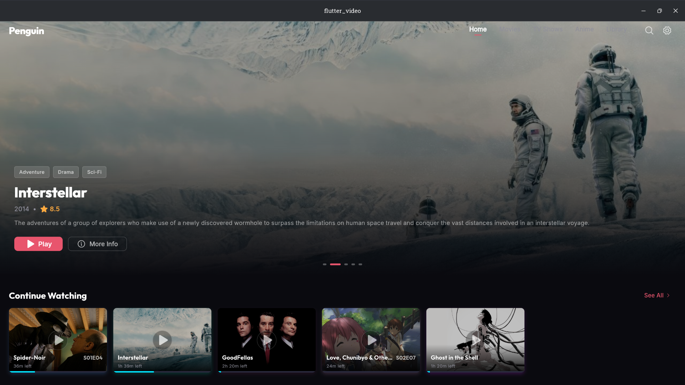
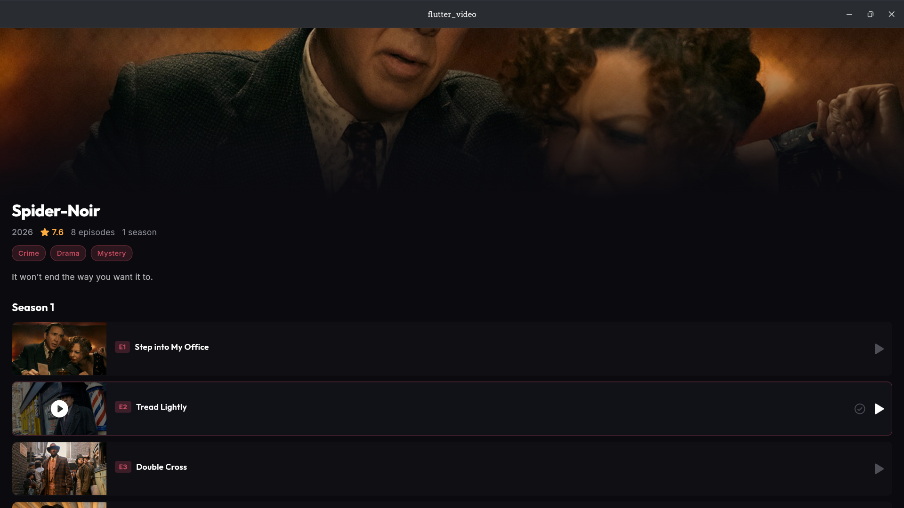
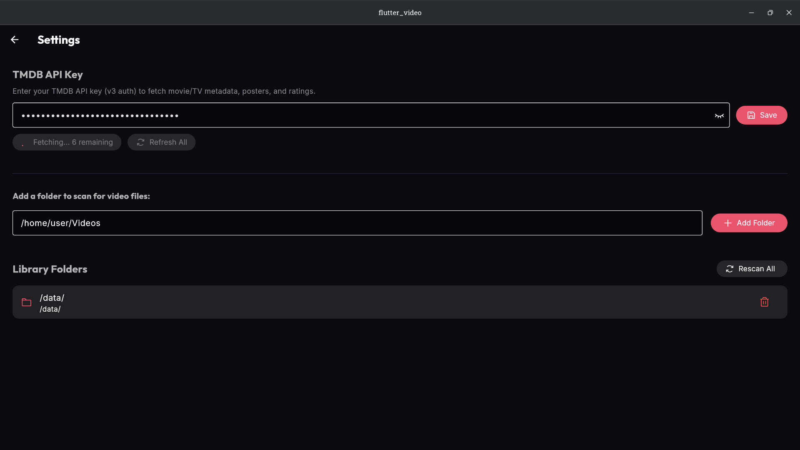

# Penguin 🐧

A beautiful, cross-platform media player with a Netflix-style UI, built with Flutter. 

## Screenshots





## Why I Built This

My main inspiration was the Infuse app on iOS, which features a modern UI and excellent metadata fetching. However, since Infuse is an iOS-only app, I set out to build something cross-platform. I wanted a simple, elegant media player that could organize my local library without any complicated setup. Many existing solutions are either too bloated, require a server, or involve a tedious setup process. Penguin is built to just work—point it to your folder, and it automatically parses your files, fetches metadata, and presents them in a beautiful, modern UI.

## Features

- **Zero-Config Folder Resolution**: The standout feature of Penguin is its simplicity. Just add a parent folder, and the application resolves and groups everything by itself—handling complex TV show and anime file structures effortlessly.
- **Beautiful Netflix-style UI**: A responsive, visually striking layout with an integrated 'Continue Watching' section and unified media grids.
- **Automatic Metadata Fetching**: Automatically grabs posters, backdrops, and details for your movies and TV shows from TMDB.
- **Video Playback**: Hardware-accelerated video decoding utilizing `media_kit`.
- **Advanced Subtitle Rendering**: Prioritizes native subtitle styles (like ASS/SSA) with configurable fallbacks.
- **Privacy-First**: Your data stays yours. Watch states and libraries are stored completely locally using SQLite (Drift).

## Tech Stack

| Layer | Technology |
|---|---|
| Framework | [Flutter](https://flutter.dev/) (Dart) |
| Playback | [media_kit](https://github.com/media-kit/media-kit) (libmpv) |
| State Management | [Riverpod](https://riverpod.dev/) |
| Database | [Drift](https://drift.simonbinder.eu/) (SQLite) |
| Metadata | [TMDB API](https://www.themoviedb.org/documentation/api) |
| UI | Material 3, Google Fonts, Phosphor Icons |

## TMDB API Key & Privacy

To fetch rich metadata (posters, synopses, ratings), Penguin requires a TMDB API key. 

**How to get a key:**
1. Create an account on [TheMovieDB (TMDB)](https://www.themoviedb.org/).
2. Go to your Account Settings > API.
3. Generate a new API key (v3 auth).

**How it's stored securely:**
When you enter your TMDB API key in Penguin, it is **stored locally on your device** (using `shared_preferences`). It is never sent to any external server other than directly to TMDB to fetch movie data. Your library, watch history, and API keys are completely private and secure.

## Platform Support

- **Linux**: Fully working and tested.
- **Windows**: Work is currently underway.
- **iOS, Web, Android**: Not yet tested (but architecturally possible via Flutter).

## Building from Source (Linux)

To compile and run Penguin on Linux, you will need the standard Flutter Linux build dependencies along with `libmpv`.

### 1. Install Dependencies

You'll need the Flutter Linux development tools and `mpv` libraries. On Ubuntu/Debian, you can install them using:

```bash
sudo apt-get update
sudo apt-get install clang cmake ninja-build pkg-config libgtk-3-dev
sudo apt-get install mpv libmpv-dev
```
*(Note: `libmpv` might already be installed on your OS if you use other media players.)*

### 2. Build and Run

Make sure you have [Flutter installed](https://docs.flutter.dev/get-started/install/linux). Then clone the repository and run:

```bash
flutter pub get
flutter run -d linux
```

To build a release executable:
```bash
flutter build linux
```

## Notes

- **Performance**(Linux only): For best performance, 100% display scaling is recommended. Fractional scaling (125%, 150%) may cause subtitle blurriness — a known Flutter/libmpv limitation being tracked.

## TODO

- [ ] Test and optimize for Android, iOS, and Web platforms.
- [ ] Fix UI stuttering and smooth out animations on linux.
- [ ] Streamline the automatic media detection and metadata fetching flow.
- [ ] Fix performance drops and blurry subtitles when using display scaling other than 100%.
- [ ] Add more comprehensive custom subtitle styling options.
- [ ] Implement smart playlists or custom collections.